# WhiteMagic Architecture Overview

**Version:** 15.1.0
**Last Updated:** February 2026

---

## System Overview

WhiteMagic is a polyglot tool substrate for agentic AI. It provides memory management, tool dispatch, ethical governance, and system introspection via the Model Context Protocol (MCP).


---

## Dispatch Pipeline

Every tool call traverses the same middleware pipeline, regardless of entry point (MCP, Python API, CLI):


### Pipeline Steps

| Step | Component | Purpose |
|------|-----------|---------|
| 0.1 | **Input Sanitizer** | Blocks prompt injection, path traversal, shell injection, oversized payloads |
| 0 | **Circuit Breaker** | Per-tool resilience (CLOSED→OPEN→HALF_OPEN). 5 failures in 60s trips breaker |
| 0.25 | **Rate Limiter** | Per-agent sliding windows. Rust atomic pre-check (452K ops/sec) + Python fallback |
| 0.3 | **RBAC** | Role-based access: observer / agent / coordinator / admin |
| 0.5 | **Maturity Gate** | Stage-gated tool access (SEED→BICAMERAL→REFLECTIVE→RADIANT→COLLECTIVE→LOGOS) |
| 1 | **Governor** | Strategic oversight and goal alignment |
| — | **Handler** | Actual tool implementation |
| 6 | **Compact Response** | Token-efficient post-processing for AI consumers |

---

## Memory Architecture


### Memory Lifecycle

1. **Store** → Memory enters as SHORT_TERM in OUTER_RIM
2. **Access** → Each access spirals memory inward (−5% galactic distance)
3. **Consolidation** → Frequently accessed SHORT_TERM promotes to LONG_TERM
4. **Association Mining** → Keywords + embeddings build semantic links
5. **Decay Drift** → Unaccessed memories drift outward (+0.005/sweep)
6. **Retention Sweep** → 7-signal scoring determines zone placement
7. **No deletion** → Memories only rotate outward, never destroyed

---

## Ethical Governance


### Governance Components

| Component | Purpose |
|-----------|---------|
| **Dharma Rules** | YAML-driven policies with 3 profiles (default/creative/secure) |
| **Karma Ledger** | Declared vs actual side-effect auditing (.jsonl persistence) |
| **Harmony Vector** | 7 dimensions: balance, throughput, latency, error_rate, dharma, karma_debt, energy |
| **Homeostatic Loop** | Graduated auto-correction watching Harmony Vector |
| **Guna Classification** | Action temperament: sattvic (pure) / rajasic (active) / tamasic (inert) |

---

## PRAT Routing (28 Gana Meta-Tools)

```mermaid
graph LR
    subgraph "Quadrants"
        direction TB
        E[🌲 East / Wood<br/>7 Ganas]
        S[🔥 South / Fire<br/>7 Ganas]
        W[⚔️ West / Metal<br/>7 Ganas]
        N[💧 North / Water<br/>7 Ganas]
    end

    subgraph "Resonance"
        R1[Predecessor Context]
        R2[Lunar Phase Amplification]
        R3[Wu Xing Boost]
        R4[Guna Adaptation]
        R5[Emotion/Drive Modulation]
    end

    A[AI Agent] -->|"gana_ghost(tool='gnosis')"| B[PRAT Router]
    B --> C[Map tool → Gana]
    C --> D[Build Resonance Context]
    D --> R1
    D --> R2
    D --> R3
    D --> R4
    E --> B
    S --> B
    W --> B
    N --> B
    B -->|dispatch| F[call_tool Pipeline]
    F --> G[Response + _resonance metadata]
    G --> R5
```



Each Gana is a consciousness lens — a way of perceiving and transforming information. The 28 Ganas map to the Chinese Lunar Mansions and form a circular sequence where each Gana has a predecessor and successor.

---

## Polyglot Acceleration Stack

```mermaid
graph TB
    subgraph "Python Core (141K LOC)"
        A[Unified API]
        B[Memory Substrate]
        C[Tool Dispatch]
        D[Governance]
    end

    subgraph "Rust (9.2K LOC) — PyO3"
        E[Galactic Batch Scoring]
        F[Association Mining]
        G[5D KD-Tree Search]
        H[BM25 Full-Text Search]
        I[Atomic Rate Limiter]
        J[MinHash Dedup]
        K[SQLite Accelerator]
        L[Keyword Extraction]
    end

    subgraph "Zig (1.5K LOC) — SIMD"
        M[Batch Cosine Similarity]
        N[Holographic 5D Distance]
        O[Constellation Grid Scan]
        P[Distance Matrix]
    end

    subgraph "Haskell (2.8K LOC) — FFI"
        Q[Boundary Detection]
        R[Maturity Gate Logic]
        S[Rule Composition]
    end

    subgraph "Other"
        T["Elixir (2.6K) — OTP actors"]
        U["Go (1.3K) — libp2p mesh"]
        V["Mojo (1.9K) — GPU/SIMD batch"]
        W["Julia (664) — stats/forecast"]
        X["TypeScript (4.6K) — SDK"]
    end

    B --> E
    B --> F
    B --> G
    B --> M
    B --> N
    D --> Q
    D --> R
    C --> I

    style E fill:#dea584,color:#000
    style M fill:#f0c040,color:#000
    style Q fill:#c9a0dc,color:#000
```



### Acceleration Strategy

Every polyglot module has a Python bridge with graceful fallback. If the compiled accelerator isn't available, the system degrades to pure Python automatically. This means:

- **`pip install whitemagic`** always works (Python-only)
- **`maturin develop --release`** unlocks Rust accelerators
- **`zig build`** unlocks SIMD accelerators
- No runtime is ever required — all accelerators are optional

---

## File Structure

```
whitemagic/                 # Python core (~763 files, 141K LOC)
├── tools/                  # MCP tool system (canonical path)
│   ├── unified_api.py      # Central call_tool() entry point
│   ├── dispatch_table.py   # Pipeline wiring
│   ├── handlers/           # Tool implementations (26 files)
│   ├── registry_defs/      # ToolDefinition declarations
│   ├── prat_router.py      # 28 Gana meta-tool router
│   └── gnosis.py           # Unified introspection portal
├── core/                   # Core subsystems
│   ├── memory/             # SQLite + holographic + embeddings
│   ├── ganas/              # 28 Gana implementations
│   ├── intelligence/       # Knowledge graph, self-model, emotion
│   ├── fusions.py          # 28 cross-system fusion functions
│   └── resonance/          # Gan Ying event bus
├── dharma/                 # Ethical policy engine
├── harmony/                # Harmony Vector, homeostasis
├── interfaces/             # API (FastAPI), webhooks
└── run_mcp.py              # MCP server entrypoint

whitemagic-rust/            # Rust accelerator (9.2K LOC)
whitemagic-zig/             # Zig SIMD (1.5K LOC)
haskell/                    # Haskell FFI (2.8K LOC)
elixir/                     # Elixir OTP (2.6K LOC)
mesh/                       # Go libp2p mesh (1.3K LOC)
whitemagic-mojo/            # Mojo GPU/SIMD (1.9K LOC)
whitemagic-julia/           # Julia stats (664 LOC)
nexus/                      # Tauri + React frontend
```
